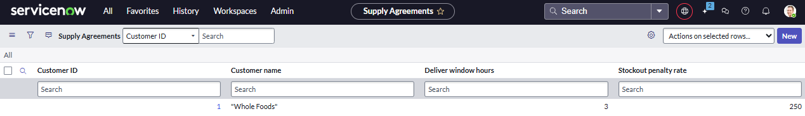

# Agentic Logistics Incident Response Instructions

📸 Process Overview.

📸 Architectural Diagram.

---

## Project Overview

The Agentic Logistics Incident Response project is an AI-driven automation solution developed at PepsiCo to streamline the handling of truck breakdowns during supply chain deliveries. When a delivery truck breaks down, the system automatically assesses the situation, plans a reroute or dispatch of a replacement, and updates all stakeholders, all with minimal human intervention. This project leverages ServiceNow’s AI Agents (autonomous AI workflows) and Amazon Bedrock for generative AI, enabling rapid decision-making and communication across multiple systems. The result is faster incident resolution, proactive delivery updates, and reduced downtime in PepsiCo’s supply chain operations.

---

## Company Context

PepsiCo is a global leader in the food and beverage industry with a vast supply chain network delivering products to retailers like Whole Foods. Ensuring on-time deliveries is critical for PepsiCo’s operations and customer satisfaction. A single truck breakdown can disrupt store inventories and lead to revenue loss. PepsiCo has been investing in AI and automation to optimize operations and this project is part of that digital transformation. By implementing autonomous AI agents within ServiceNow, PepsiCo aims to close the gap between incident occurrence and response. These agents act as “digital teammates,” capable of observing issues, planning solutions, and taking actions to achieve business goals. In this context, the project integrates with PepsiCo’s logistics partners (like Schneider for transportation and Whole Foods as a customer) to coordinate incident responses seamlessly across company boundaries.

---

## Business Problem

**The problem:** When a delivery truck breaks down en route, multiple things need to happen quickly – the delivery schedule must be adjusted, a new truck or route must be arranged, stakeholders need to be notified, and service-level agreements (SLAs) monitored. Traditionally, this process involves frantic phone calls, manual data entry, and delays in communication. These breakdown incidents can lead to late deliveries, stockouts at retail stores, SLA breaches, and increased operational costs. Moreover, manual handling is error-prone and doesn’t scale well for a large operation like PepsiCo’s.

**The solution:** Agentic Logistics Incident Response automates the entire incident lifecycle for truck breakdowns. As soon as a breakdown is reported (or detected) and logged as an incident in ServiceNow, the system’s AI agents spring into action. Agent 1 immediately reviews the issue details, creates an incident, checks the relevant SLA commitments and calculates the impact using ServiceNow's Now language model. Agent 2 calculates the best chosen option sourced from the Agent 1 calculation and passes the selected route to Agent 3. Then Agent 3 orchestrates the execution: it communicates with external systems (like Schneider’s fleet management and Whole Foods’ delivery scheduling system) to implement the reroute and provide updates. It then updates the status of the issue to Dispatched (full circle). By automating analysis and cross-company coordination, this solution minimizes delay and ensures that both PepsiCo and its partners have real-time updates on the delivery status. In short, it turns a previously reactive, manual process into a proactive, automated workflow, reducing delivery downtime and improving reliability.

---

## Architecture Overview

The system architecture is composed of three specialized AI agents within a hybrid ServiceNow and external workflow environment, all connected through a coherent agentic framework:

### ServiceNow Platform (Core & AI Agents)
ServiceNow serves as the central hub where the incident is initially recorded and processed. The platform’s new AI Agent capabilities (available via ServiceNow’s AI Platform) allow for autonomous workflows that can use tools and AI reasoning. The two agents are fired when the built Use Case detects a change in the status of the issue (status is either created as or updated with "pending"). Agent 1 (Route Financial Analysis Agent) and Agent 2 (Route Decision Agent) are configured on the ServiceNow platform. They utilize Now Assist generative AI (with NowLLM) to interpret data and make decisions. (NowLLM is ServiceNow’s proprietary LLM tuned for ServiceNow workflows, providing context-aware responses within ITSM processes.) Later on in the project, Amazon Bedrock powers the Agent 3 execution. Agent 1 pulls relevant SLA data (e.g. proposed routes) and uses the LLM to assess impact, while Agent 2 uses the LLM to choose the best rerouting solution based on business rule set cost and estiamted tiem of delivery.

### Agent 3 (Orchestrator via n8n)
The third agent is an orchestration workflow hosted on n8n, an open-source automation platform that connects various services and APIs. ServiceNow triggers Agent 3 (e.g. via a webhook or IntegrationHub action) once Agents 1 and 2 have formulated a plan. Agent 3 runs in n8n to perform external communications that ServiceNow alone cannot directly handle. Specifically, Agent 3 uses the Model Context Protocol (MCP) to interface with external systems. MCP is an open standard that allows AI-driven applications to connect to external data sources and tools in a uniform way. Think of MCP as a “USB-C port” for AI applications, standardizing how Agent 3 communicates with outside systems. In this project, Schneider (the carrier managing the truck fleet) and Whole Foods (the delivery recipient) each host an MCP server. Agent 3 (running in n8n) acts as an MCP client: it sends a reroute request to Schneider’s MCP endpoint and sends a delivery delay notification to Whole Foods’ MCP endpoint. The use of MCP ensures these communications follow a secure, standardized protocol for AI-to-system interactions.

### Data Tables and Outputs in ServiceNow
Within ServiceNow, three key record types are involved: the Supply Agreement (containing the penalty rate per hour), the Incident (representing the breakdown event) and a custom Delivery Delays table that tracks shipment delays and statuses. The architecture ensures that once the orchestration is complete, these records are updated accordingly. For example, the Delivery Delays is recrods the status of the issue (pending -> calucalted -> approved -> dispatched) with notes on actions taken, as well as the new expected delivery time, delay duration, and reason (truck breakdown reroute) for downstream visibility.

📸 New Delivery Delay.

📸 Incident Table.

📸 Supply Agreement Table.

All components work together in a loosely coupled way. ServiceNow’s AI Agents focus on decision-making and internal record updates, while n8n (Agent 3) handles cross-system orchestration. The integration points (ServiceNow to n8n, n8n to external MCP servers) are secured and use standard interfaces (HTTP/MCP), making the architecture modular and extensible. If PepsiCo onboards new carriers or customers, they can add new MCP endpoints without redesigning the core logic – the AI agents would simply gain new “tools” or endpoints to call via the orchestrator.

---

## Setup Requirements

To deploy or replicate this project, ensure the following prerequisites and configurations are in place:

### ServiceNow Instance with AI Capabilities
You will need a ServiceNow instance (preferably running the Now Platform release that supports AI Agents, e.g. Vancouver or later). The instance should have Now Assist enabled and configured for generative AI. Ensure that the AI Agent Studio (to define autonomous agents) and related plugins are activated. 

### Amazon Bedrock Access
Obtain AWS credentials (Access Key ID and Secret Key) that have permissions to use Amazon Bedrock’s API. You may need to request access to Bedrock if it’s not generally available in your AWS region. Once you have access, note the Bedrock endpoint URL for your region (from AWS console or docs) to configure in ServiceNow. Using Bedrock may incur AWS costs, so ensure you have billing awareness and have set up any necessary cost controls. 

### n8n Orchestration Environment
Set up an n8n instance. n8n will host Agent 3’s workflow. Make sure your n8n instance is accessible to both ServiceNow and the internet (for reaching out to Schneider/Whole Foods endpoints). Install the MCP nodes in n8n if not already available. The n8n has a custom package that provides an MCP Server Trigger and MCP Client node. In our case, we use an MCP Client node in n8n to connect to the external MCP servers. 

### External MCP Server Access (Schneider & Whole Foods)
Coordinate with the external partners (or their technical teams) to obtain the MCP endpoint details and credentials. Schneider (as a logistics provider) and Whole Foods (as a customer) each need to expose certain functionality via MCP – for example, Schneider’s MCP server might provide a “Reschedule Delivery” or “Dispatch Truck” tool, and Whole Foods’ MCP server might offer an endpoint to update expected delivery times. These servers could require API keys or tokens for authentication, which must be stored securely (e.g. in n8n credentials). If you do not have real endpoints (for a demo, perhaps), you might simulate them with dummy MCP servers or use n8n itself to stand up temporary MCP endpoints to test the flow.

### ServiceNow Integration to n8n
Decide how ServiceNow will trigger the n8n workflow (Agent 3). This approach is using the ServiceNow AI Agent to send an HTTP request to n8n’s webhook URL. Ensure that the authentication and network access is configured (e.g., if n8n is hosted behind a firewall/VPN, the SN instance must be able to reach it). In our implementation, a simple outbound REST action from ServiceNow to an n8n webhook (with a JSON payload containing incident ID and suggested plan) triggers Agent 3.

### Security and Permissions
Make sure to store all sensitive keys (AWS keys, MCP API tokens) in secure credential stores. 

---

## Usage Guide (Step-by-Step)

Once the system is set up, here’s how to use it to handle a truck breakdown incident from start to finish:

1. **Incident Trigger:** Create or identify a Truck Breakdown incident in ServiceNow Delivery Delays and Supply Agremeents table. This could be logged automatically from the truck or manually by a dispatcher. The incident should contain key details such as the truck/route ID, location of breakdown, and the customer affected. In our setup, simply creating (or updating to) a new delivery delay with a status of pending triggers the Use Case which trigges the AI workflow. 

📸 New Delivery Delay.

📸 Use Case.

2. **Agent 1 – SLA Review:** As soon as the incident is created, Agent 1 (Route Financial Analysis Agent) activates. It uses Now Assist with NowLLM to analyze the incident in natural language. Agent 1 pulls the penalty and delivery delay information related to this delivery. For example, the per hour late penalty for the particular customer is $250 and the delivery's SLA is 3 hours. If rerouted truck will take 5 hours to make the delivery, the the SLA is breached by 2 hours and the penalty is $500 and so on. The agent creates and Incident and assigns the incident to an employee for possible tracking. Finally, it calculates the impact among several proposed rerouting options and records it in the Delivery Delays table. 

📸 Agent 1.

📸 Agent 1 Tools.

3. **Agent 2 – Route Optimization:** Next, Agent 2 (Route Decision Agent) kicks in right after Agent 1’s analysis. Agent 2 gathers the proposed by Agent 1 options and selects the best one based on the lowest penalty and shortest time (if tied on penalty). It then updates the Incident record's impact and urgency based on the predefined rules and creates a JSON file containing all pertinent data from the best reroute option. Once the JSON is assembled, Agent 2 passes it to the Agent 3 via the webhook URL.

📸 Agent 2.

📸 Agent 2 Tools.

4. **Agent 3 – Orchestration (n8n Workflow):** Once a reroute/dispatch plan is ready, Agent 3 is invoked to execute it. ServiceNow sends the necessary data to n8n, where the Agent 3 workflow based on the AWS Bedrock Chat Model runs. The n8n workflow performs the following sub-steps related to notifying the interested parties as well as ServiceNow (covered in point 5 below):

   **4a. Notify Schneider (Carrier):** The workflow calls Schneider’s MCP server endpoint (e.g., an MCP tool execute_route) to notify of the proposed reroute. Through this call, Agent 3 provides details like the truck ID, affected route ID, and option chosen (option ID, route number, distance, and arrival time). The MCP protocol ensures the request is properly formatted and secured.

   **4b. Update Whole Foods (Customer):** Next, the workflow calls Whole Foods’ MCP endpoint, which could be a tool to update the customer on the breakdown. Agent 3 sends the same payload as to the carrier. 

📸 Agent 3.

5. **ServiceNow Update – Completion:** After successful external communication, Agent 3 (via the n8n workflow) sends a callback or makes an API call back to ServiceNow to update the records. The incident is updated to reflect that a reroute has been executed. The status of the incident is set to **Dispatched**.

At this point, an end user (e.g., a supply chain manager) can refresh the Delivery Delays dashboard and see that the entry for this route now shows a confirmed delay with the reason and new ETA time. The incident in the ITSM view will show as resolved with notes on actions taken by the AI agents.

Throughout these steps, no manual intervention was needed unless an error occurred. The agents collaborate (Agent 1 & 2 gathering info and deciding, Agent 3 executing the plan) much like a human team would – but in seconds and in a standardized way every time. This improves response time drastically from the manual process.

📸 Now Assist Resolution.

📸 AI Agent Studio Resolution.

---

## Expected Output

After running through an incident with the above process, you can expect the following outcomes in the system:

- **Delivery Delays Table Entry:** The corresponding entry in the Delivery Delays table (which tracks all delivery schedule changes) will reflect the new status. Before the incident, this entry might have shown an on-time delivery. When the breakdown happened and before the solution, it would show a “delay pending” status (perhaps with a provisional ETA). After Agent 3’s execution, the entry is finalized with a **Delayed** status, the confirmed new delivery time, and notes such as “Delay due to truck breakdown, mitigated by dispatching backup truck.” The before-and-after difference in this record (initial vs. final) confirms that the system successfully mitigated the issue.

📸 Delivery Delays Table After.

- **Incident Table:** The incident is created and updated with urgency/impact based on the predefined rules tied to the penalty amount.

- **Execution Logs:** In n8n, the execution of the workflow for Agent 3 will appear in the execution log (you can see a successful run marked with timestamps). In ServiceNow, the AI Agent interactions might also be logged in the Now Assist interface or system logs (useful for debugging or improvement). These logs confirm the agent reasoning steps and tool usage.

- **Stakeholder Awareness:** The Whole Foods store (or their system) is now aware of the delay and new ETA, reducing potential confusion at delivery time. The PepsiCo logistics team can also be automatically notified, e.g., by subscribing to updates from the Delivery Delays table or via a notification that the incident was resolved by AI action.

In summary, the expected output is a fully handled incident: the breakdown issue is resolved through a reroute, and all records and parties are up to date. The delivery is still completed (albeit delayed), and everything is documented. The process showcases reduced downtime and high transparency.

---

## Proposed Optimizations

1) Notifications + dedupe — when a delay is detected, create a ServiceNow task and send a Slack/email alert, but record the route_id as “alerted” for a short window (e.g., 30 min) so you don’t spam the team. Monitor the Incident table for duplicates. 

2) Retries + stability — if an MCP call fails, retry a few times with increasing waits.

3) Observability dashboards — collect request/response logs, status codes, latencies and show failure rate and mean time to dispatch so you can spot regressions fast.

4) Automatic assignment to any individual within appropriate group. 

5) Automatic Incident resoltuion once the delivery is executed with a customer. 
